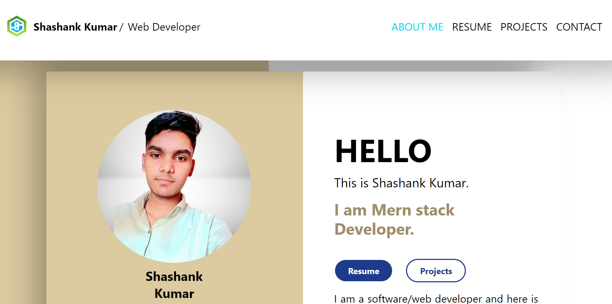

# Portfolio Website

Welcome to my personal portfolio website! 🎉 This site showcases my projects, skills, and professional journey as a Fullstack developer.  

Visit my portfolio here: [my Portfolio URL](https://myporfolio-phi.vercel.app/) 

---

## 🛠️ Features

- **About Me**: A brief introduction and background about me, including my professional journey, interests, and goals.
- **Projects**: A showcase of my key projects with live demos, source code, and detailed descriptions of their purpose, features, and technologies used.
- **Skills**: An overview of my technical expertise, tools, and frameworks I work with, as well as relevant soft skills.
- **Experience**: Highlights of my professional work experience, internships, and freelance projects.
- **Education**: A section detailing my academic background, courses, and certifications relevant to my career.
- **Achievements & Awards**: Recognition for my accomplishments in the form of awards, certificates, or notable mentions.
- **Testimonials**: Feedback or recommendations from colleagues, mentors, or clients.
- **Blog/Articles**: A section where I share my thoughts, tutorials, and insights on topics related to my field.
- **Contact**: Multiple ways to reach out, including a contact form, email, and social media links.
- **Responsive Design**: Optimized for all devices, from desktops to mobile, ensuring a seamless user experience.

---

## 🎯 Goals of the Website

- To provide an engaging platform for potential employers or clients to learn about me.
- To demonstrate my technical skills through interactive and responsive design.
- To serve as a central hub for my projects, articles, and achievements.
- To make it easy for visitors to contact me or collaborate.

---

## 🌟 Highlights

- **Interactive Animations**: Subtle animations to improve user experience without overwhelming.
- **Modern Aesthetic**: Clean, minimalistic design inspired by modern UI/UX principles.
- **Accessibility**: Built with accessibility best practices to ensure usability for everyone.
- **Performance**: Fast loading times and optimized assets.
- **SEO-Friendly**: Configured to rank well on search engines for relevant queries.

---

## 🛠️ Technologies Used

- **Frontend**: [React.js](https://reactjs.org/)
- **Styling**: [Tailwind CSS](https://tailwindcss.com/), CSS Modules
- **Animations**: [Framer Motion](https://www.framer.com/motion/) / CSS animations
- **Backend**: [Node.js](https://nodejs.org/) / [Express.js](https://expressjs.com/) (Optional for contact forms or APIs)
- **Database**: [MongoDB](https://www.mongodb.com/) 
- **Version Control**: Git & GitHub
- **Deployment**: [Vercel](https://vercel.com/)

---

## 🚀 Getting Started

1. **Clone the Repository**:
   ```bash
   git clone https://github.com/shashank2314/myporfolio
